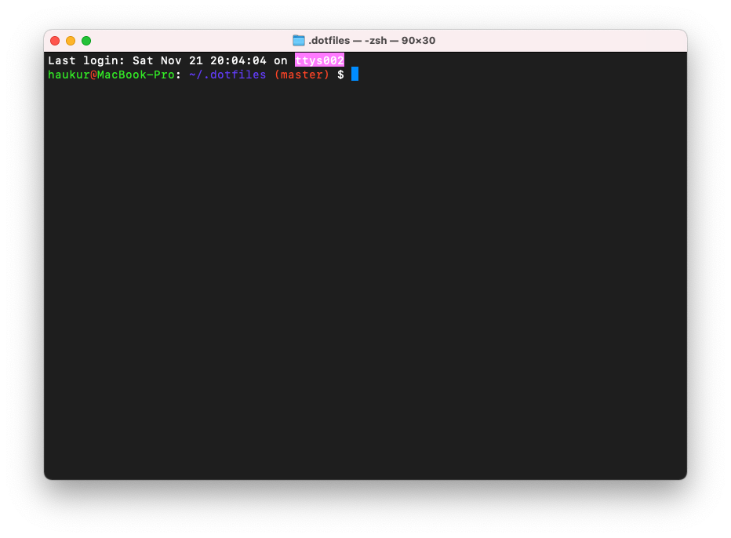

# My personal dotfiles

## shell

Configuration files for zsh and bash are available.

Easiest way to implement:

```shell
cd ~
git clone git@github.com:haukurh/.dotfiles.git
# bash
mv .bashrc .bashrc.bak && ln -s .dotfiles/.bashrc .
# zsh
mv .zshrc .zshrc.bak && ln -s .dotfiles/.zshrc .
```

## git config

Some useful git configuration can be included in `~/.gitconfig`

```ini
[user]
name = <YOUR NAME>
email = <YOUR EMAIL>
signingkey = <YOUR GPG KEY ID>

[include]
path = ~/.dotfiles/gitconfig

[includeIf "gitdir:~/src/work/"]
path = ~/.gitconfig-work

[includeIf "gitdir:~/src/projects/"]
path = ~/.gitconfig-personal

[commit]
gpgsign = true

[tag]
gpgsign = true
```

With these includeIf statements we can have custom settings based on folders,
this can be useful if you use have different git email for work vs. personal for example.

This config suggest that you use GPG to sign your commits. If you're not already doing so you
read up on it in the GitHub documentation.

Sources:

- [GitHub Docs: Managing commit signature verification](https://docs.github.com/en/authentication/managing-commit-signature-verification)

## macOS terminal

iTerm2 and oh-my-zsh are boring...

Why not simply configure terminal to pretty and familiar?

You can import the Terminal.terminal profile into the macOS terminal



_I mean do you see that pink highlighting_ 👆
